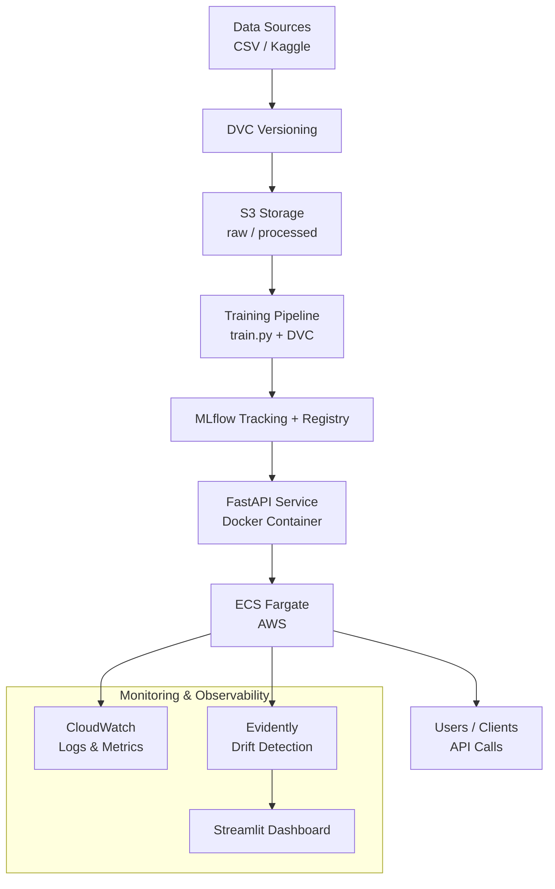

# MLOps Ticket Classifier

**End-to-End MLOps Project: From Data to Production with Monitoring & CI/CD**


---


---

## 📋 Project Overview

This repository demonstrates a complete **MLOps pipeline** for classifying customer support tickets (e.g., billing, technical, refund, account issues).

The goal is to build a production-ready system that includes:

- Data versioning
- Experiment tracking
- Model serving via a clean API
- Containerization
- Cloud deployment (serverless)
- Monitoring (logs + data/model drift)
- Dashboard for business insights
- Full CI/CD automation

Built with modern 2026 best practices: **reproducible, observable, and automated**.

**Why this project?**  
It covers the full MLOps lifecycle that recruiters and hiring managers look for in junior/intermediate MLOps or ML Engineer roles.

---

## 🎯 Features & Deliverables

### Version 0.1 – Local MVP
- Reproducible training pipeline with DVC
- Baseline model (TF-IDF + Logistic Regression / LightGBM)
- MLflow experiment tracking + Model Registry
- FastAPI prediction service with input validation
- Local Docker Compose setup

### Version 1.0 – Cloud Deployment
- Data and model storage in Amazon S3
- Dockerized API pushed to Amazon ECR
- Serverless deployment on **AWS ECS Fargate**
- Publicly accessible API endpoint
- Basic logging to CloudWatch

### Version 2.0 – Production Ready
- Structured logging + CloudWatch integration
- Data and model drift detection with **Evidently AI**
- Interactive Streamlit dashboard (request volume, class distribution, drift reports, prediction examples)
- Full CI/CD pipeline with GitHub Actions (test → build → push → deploy)
- Automated workflows for training and deployment

---

## 🏗️ Architecture



---

## 🛠️ Tech Stack

| Layer  | Technology |
| :--------------- |:---------------|
| Language | Python 3.11+ |
| Data Versioning | DVC + S3 |
| Experiment Tracking | MLflow 3.x |
| Model Serving | FastAPI + Pydantic |
| Containerization | Docker + Docker Compose |
| Registry | Amazon ECR |
| Deployment | AWS ECS Fargate (serverless) |
| Storage | Amazon S3 |
| Monitoring | CloudWatch + Evidently AI |  
| Dashboard | Streamlit |
| CI/CD | GitHub Actions |
| Dependency Management | Poetry |

---

## 📁 Project Structure
```
mlops-ticket-classifier/
├── .github/workflows/          # CI/CD pipelines
├── data/                       # Raw data + .dvc files
├── models/                     # Local model artifacts (gitignored)
├── src/
│   ├── preprocessing/          # Data cleaning & feature engineering
│   ├── training/               # train.py, model utils
│   ├── api/                    # FastAPI app, routers, schemas
│   ├── monitoring/             # Evidently drift checks
│   └── utils/                  # Config, logging
├── notebooks/                  # Exploration only (not for production)
├── tests/                      # Unit + integration tests
├── .dvc/                       # DVC configuration
├── Dockerfile
├── docker-compose.yml
├── dvc.yaml                    # Pipeline definition
├── pyproject.toml              # Poetry dependencies
├── Makefile                    # Common commands (make train, make api, ...)
├── README.md
├── .env.example
└── requirements.txt            # Optional fallback
```

---

## Quick Start (Local)
### Using Makefile
```
make setup → installe all
make format → format code
make train → traîn model
make api → launches the API in dev
make up → launch everything with Docker
```

### 1. Clone the repository
```
git clone https://github.com/0xrubusdata/mlops-ticket-classifier.git
cd mlops-ticket-classifier
```

### 2. Set up environment
```
# Using Poetry (recommended)
poetry install
poetry shell

# Or with venv + pip
python -m venv venv
source venv/bin/activate
pip install -r requirements.txt
```

### 3. Prepare data & train
```
# Pull data with DVC
dvc pull

# Reproduce the full pipeline
dvc repro

# Or run training manually
make train
```

### 4. Run services locally
```
# Start MLflow + API
docker-compose up --build
```

### 5. Test the API
```
curl -X POST http://localhost:8000/predict \
  -H "Content-Type: application/json" \
  -d '{"text": "My invoice is wrong and I was charged twice!"}'
```

---

## 📊 How to Use 

**Training**: make train or dvc repro  
**API Development**: make api  
**MLflow UI**: mlflow ui (or via docker-compose)  
**Dashboard**: streamlit run dashboard/app.py  
**Full pipeline reproduction**: dvc repro  

---

## ☁️ Cloud Deployment

The project is designed for **AWS ECS Fargate** (serverless containers).  
**Main steps (detailed in docs/DEPLOYMENT.md)**:

1. Create S3 bucket and ECR repository
2. Build & push Docker image via GitHub Actions
3. Deploy service on ECS Fargate
4. Configure CloudWatch logging
5. (Optional) Deploy Streamlit dashboard separately

The API will be accessible via a public load balancer or custom domain.

---

## 📈 Monitoring & Observability

- **Logs**: Structured JSON logs sent to Amazon CloudWatch
- **Drift Detection**: Evidently AI reports (data drift & model drift)
- **Dashboard**: Streamlit app showing:  
    - Request volume over time  
    - Prediction class distribution  
    - Recent drift alerts  
    - Sample predictions

---

## 🧪 CI/CD Pipeline

GitHub Actions workflows include:

- Linting & unit tests
- Integration tests for API
- Docker image build & security scan
- Push to Amazon ECR
- Automatic deployment to ECS Fargate (on merge to main)

---

## 📚 Documentation

- Architecture Decision Records (ADR)
- Deployment Guide
- Contributing
- License

---

## 🎥 Demo & Screenshots

**Live API** (once deployed):

---

## 🤝 Contributing

Feel free to open issues or submit pull requests. This project is meant to evolve as I learn more MLOps practices.

---

## 📝 License

MIT License – see LICENSE file.

---

## ✍️ About This Project

Built as a portfolio project to demonstrate real-world MLOps skills in 2026.  
Follow my build-in-public journey on X (https://x.com/Data0x88850) with hashtag **#MLOpsJourney**.  
**Made with ❤️ for the MLOps community**.